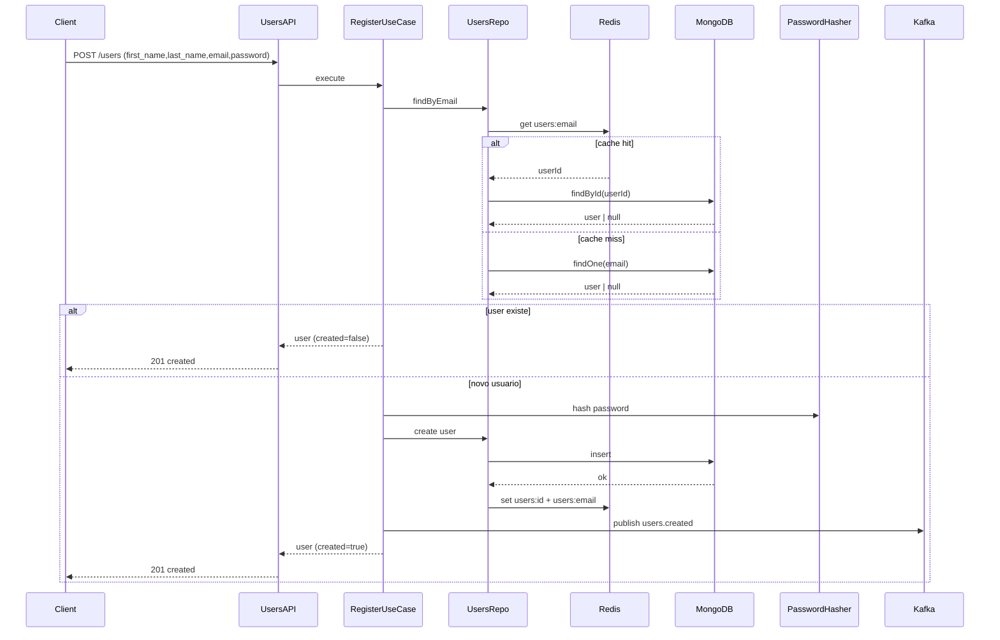
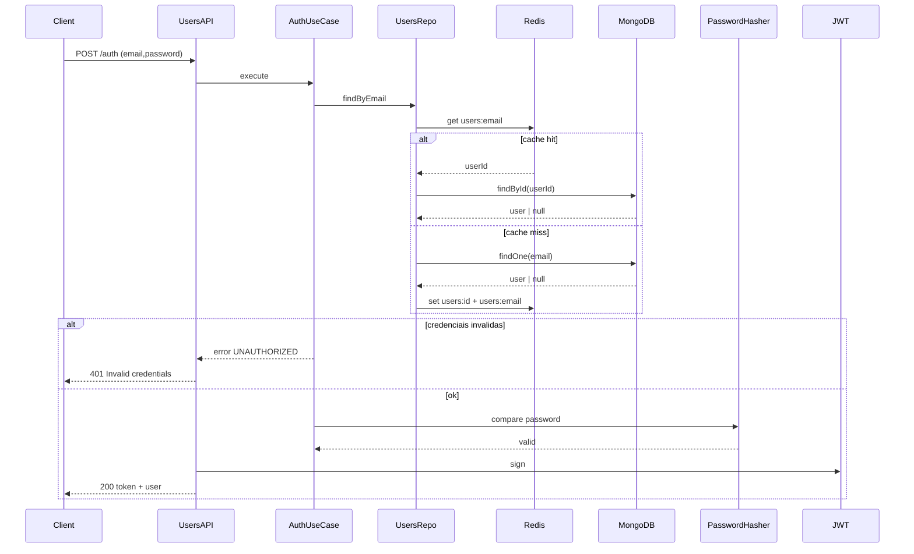
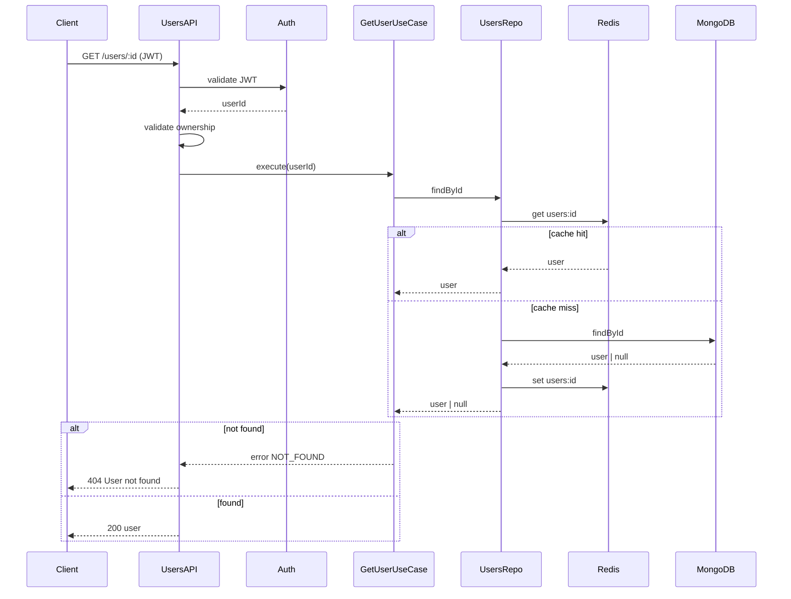
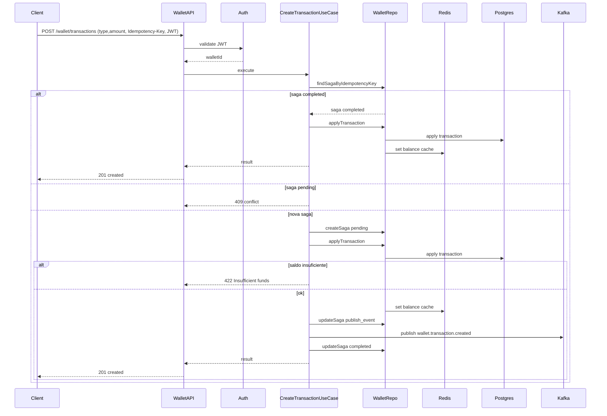
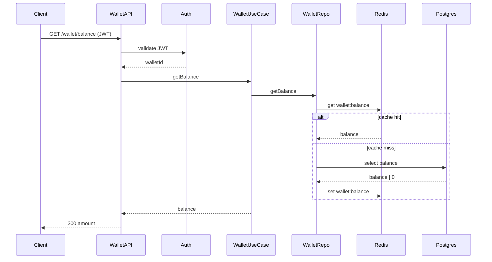
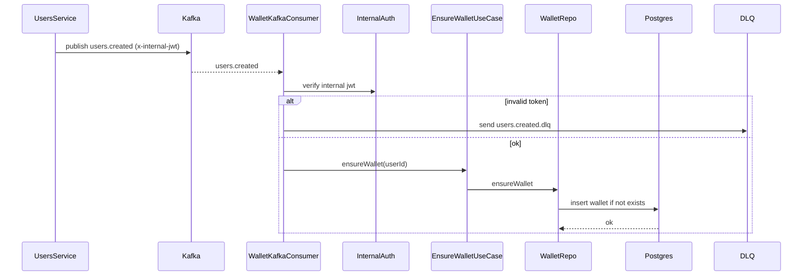
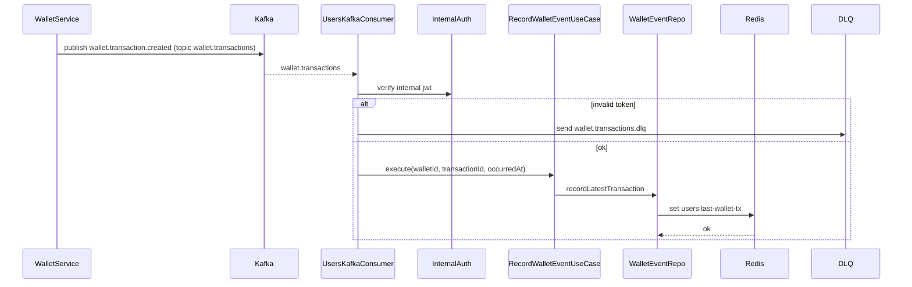

# ília - Code Challenge NodeJS
**English**
##### Before we start ⚠️
**Please create a fork from this repository**

## The Challenge:
One of the ília Digital verticals is Financial and to level your knowledge we will do a Basic Financial Application and for that we divided this Challenge in 2 Parts.

The first part is mandatory, which is to create a Wallet microservice to store the users' transactions, the second part is optional (*for Seniors, it's mandatory*) which is to create a Users Microservice with integration between the two microservices (Wallet and Users), using internal communications between them, that can be done in any of the following strategies: gRPC, REST, Kafka or via Messaging Queues and this communication must have a different security of the external application (JWT, SSL, ...), **Development in javascript (Node) is required.**


### General Instructions:
## Part 1 - Wallet Microservice

This microservice must be a digital Wallet where the user transactions will be stored 

### The Application must have

    - Project setup documentation (readme.md).
    - Application and Database running on a container (Docker, ...).
    - This Microservice must receive HTTP Request.
    - Have a dedicated database (Postgres, MySQL, Mongo, DynamoDB, ...).
    - JWT authentication on all routes (endpoints) the PrivateKey must be ILIACHALLENGE (passed by env var).
    - Configure the Microservice port to 3001. 
    - Gitflow applied with Code Review in each step, open a feature/branch, create at least one pull request and merge it with Main(master deprecated), this step is important to simulate a team work and not just a commit.

## Part 2 - Microservice Users and Wallet Integration

### The Application must have:

    - Project setup documentation (readme.md).
    - Application and Database running on a container (Docker, ...).
    - This Microservice must receive HTTP Request.   
    - Have a dedicated database(Postgres, MySQL, Mongo, DynamoDB...), you may use an Auth service like AWS Cognito.
    - JWT authentication on all routes (endpoints) the PrivateKey must be ILIACHALLENGE (passed by env var).
    - Set the Microservice port to 3002. 
    - Gitflow applied with Code Review in each step, open a feature/branch, create at least one pull request and merge it with Main(master deprecated), this step is important to simulate a teamwork and not just a commit.
    - Internal Communication Security (JWT, SSL, ...), if it is JWT the PrivateKey must be ILIACHALLENGE_INTERNAL (passed by env var).
    - Communication between Microservices using any of the following: gRPC, REST, Kafka or via Messaging Queues (update your readme with the instructions to run if using a Docker/Container environment).

#### In the end, send us your fork repo updated. As soon as you finish, please let us know.

#### We are available to answer any questions.


Happy coding! 🤓

## Projeto
Este repositório implementa dois microsserviços em Node.js com TypeScript seguindo clean architecture:
- `src/wallet` (porta 3001) com PostgreSQL
- `src/users` (porta 3002) com MongoDB

A comunicação interna é feita via Kafka e ambos usam Redis para cache.

## Como executar localmente
Pré-requisitos: Docker e Docker Compose.

```bash
docker-compose up --build
```

## Migrations (Postgres)
Para aplicar as migrations do wallet:

```bash
npm run migrate:up
```

## Variáveis de ambiente
As variáveis abaixo já estão definidas no `docker-compose.yml` e podem ser ajustadas conforme necessário:

Wallet:
- `PORT`
- `JWT_PRIVATE_KEY`
- `INTERNAL_JWT_PRIVATE_KEY`
- `PG_HOST`
- `PG_PORT`
- `PG_USER`
- `PG_PASSWORD`
- `PG_DATABASE`
- `REDIS_URL`
- `KAFKA_BROKERS`

Users:
- `PORT`
- `JWT_PRIVATE_KEY`
- `INTERNAL_JWT_PRIVATE_KEY`
- `MONGO_URI`
- `REDIS_URL`
- `KAFKA_BROKERS`

## Endpoints
Todos os endpoints exigem JWT no header `Authorization: Bearer <token>`.
Endpoints de escrita exigem também o header `Idempotency-Key` não vazio. Quando ausente/inválido, a API retorna `422` com código `IDEMPOTENCY_KEY_REQUIRED`.

Wallet:
- `POST /transactions`
  - header obrigatório: `Idempotency-Key: <string>`
  - body: `{ "type": "CREDIT" | "DEBIT", "amount": string }`
- `GET /wallet/balance`
  - response: `{ "balanceCents": number }`

Users:
- `POST /users`
  - header obrigatório: `Idempotency-Key: <string>`
  - body: `{ "name": string, "email": string }`
- `PATCH /users/:id`
  - header obrigatório: `Idempotency-Key: <string>`
- `DELETE /users/:id`
  - header obrigatório: `Idempotency-Key: <string>`
- `GET /users/me`

Health checks:
- `GET /health`
- `GET /ready`

## Diagramas de sequência

### Cadastro de usuário (`POST /users`)


### Login (`POST /auth`)


### Consulta de usuario por id (`GET /users/:id`)


### Transacao na carteira (`POST /wallet/transactions`)


### Consulta de saldo (`GET /wallet/balance`)


### Evento `users.created` -> criacao da wallet (Kafka)


### Evento `wallet.transaction.created` -> atualizacao no Users (Kafka)


## Kafka
Tópicos usados:
- `users.created`
- `wallet.transactions`
- `users.created.dlq`
- `wallet.transactions.dlq`
