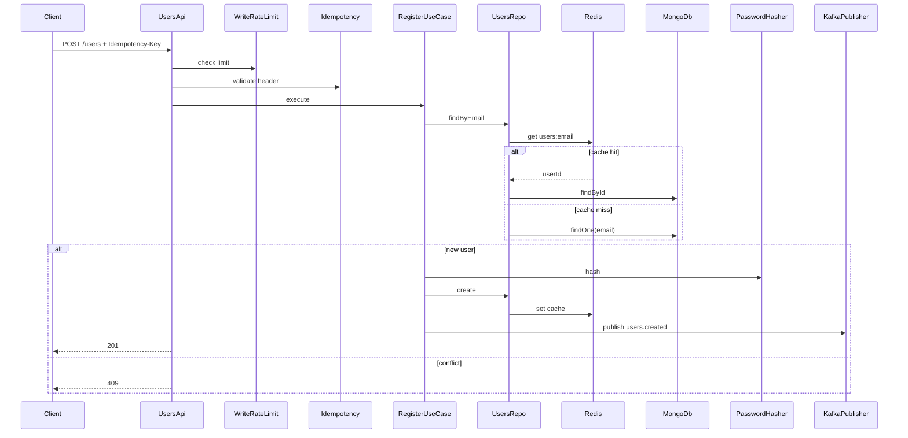
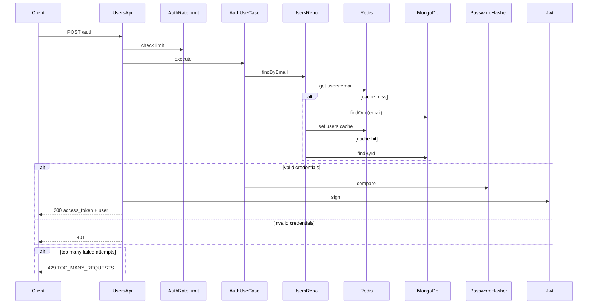
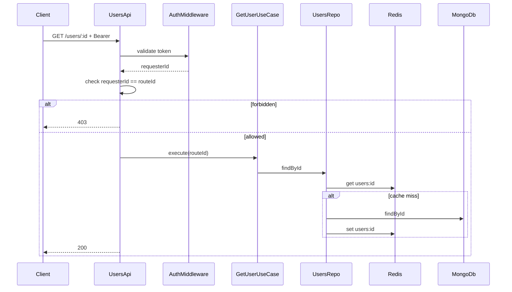
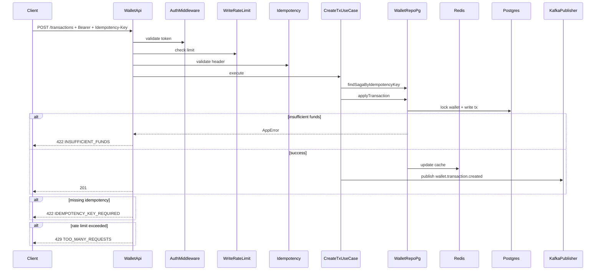
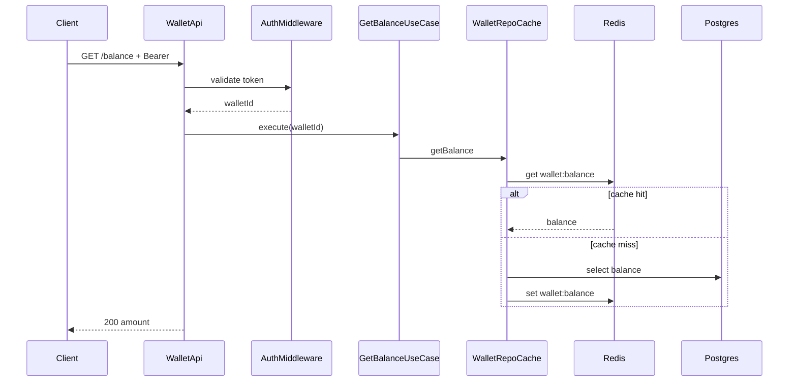
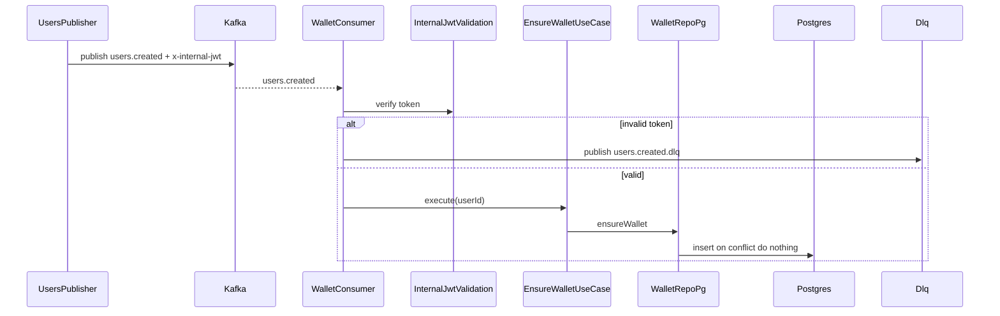
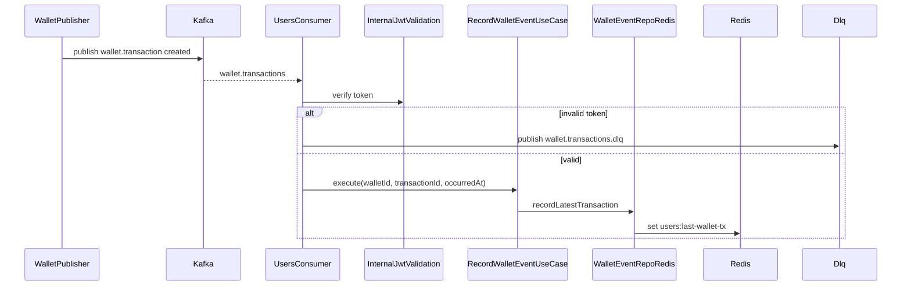

# ília - Code Challenge NodeJS
**English**
##### Before we start ⚠️
**Please create a fork from this repository**

## The Challenge:
One of the ília Digital verticals is Financial and to level your knowledge we will do a Basic Financial Application and for that we divided this Challenge in 2 Parts.

The first part is mandatory, which is to create a Wallet microservice to store the users' transactions, the second part is optional (*for Seniors, it's mandatory*) which is to create a Users Microservice with integration between the two microservices (Wallet and Users), using internal communications between them, that can be done in any of the following strategies: gRPC, REST, Kafka or via Messaging Queues and this communication must have a different security of the external application (JWT, SSL, ...), **Development in javascript (Node) is required.**


### General Instructions:
## Part 1 - Wallet Microservice

This microservice must be a digital Wallet where the user transactions will be stored 

### The Application must have

    - Project setup documentation (readme.md).
    - Application and Database running on a container (Docker, ...).
    - This Microservice must receive HTTP Request.
    - Have a dedicated database (Postgres, MySQL, Mongo, DynamoDB, ...).
    - JWT authentication on all routes (endpoints) the PrivateKey must be ILIACHALLENGE (passed by env var).
    - Configure the Microservice port to 3001. 
    - Gitflow applied with Code Review in each step, open a feature/branch, create at least one pull request and merge it with Main(master deprecated), this step is important to simulate a team work and not just a commit.

## Part 2 - Microservice Users and Wallet Integration

### The Application must have:

    - Project setup documentation (readme.md).
    - Application and Database running on a container (Docker, ...).
    - This Microservice must receive HTTP Request.   
    - Have a dedicated database(Postgres, MySQL, Mongo, DynamoDB...), you may use an Auth service like AWS Cognito.
    - JWT authentication on all routes (endpoints) the PrivateKey must be ILIACHALLENGE (passed by env var).
    - Set the Microservice port to 3002. 
    - Gitflow applied with Code Review in each step, open a feature/branch, create at least one pull request and merge it with Main(master deprecated), this step is important to simulate a teamwork and not just a commit.
    - Internal Communication Security (JWT, SSL, ...), if it is JWT the PrivateKey must be ILIACHALLENGE_INTERNAL (passed by env var).
    - Communication between Microservices using any of the following: gRPC, REST, Kafka or via Messaging Queues (update your readme with the instructions to run if using a Docker/Container environment).

#### In the end, send us your fork repo updated. As soon as you finish, please let us know.

#### We are available to answer any questions.


Happy coding! 🤓

## Projeto
Este repositório implementa dois microsserviços em Node.js com TypeScript seguindo clean architecture:
- `src/wallet` (porta `3001`) com PostgreSQL
- `src/users` (porta `3002`) com MongoDB

A comunicação interna é feita via Kafka, ambos usam Redis para cache e rate limiting, e a stack de observabilidade inclui Prometheus, Grafana e Loki.

## Como executar localmente
Pré-requisitos: Docker e Docker Compose.

```bash
docker-compose up --build
```

Comandos úteis:

```bash
docker-compose up --build -d
docker-compose logs -f users wallet
docker-compose down
```

Pontos de acesso:
- Wallet API: `http://localhost:3001`
- Users API: `http://localhost:3002`
- Prometheus: `http://localhost:9090`
- Grafana: `http://localhost:3000` (`admin` / `admin`)
- Loki: `http://localhost:3100`

## Migrations (Postgres)
Para aplicar as migrations do wallet:

```bash
npm run migrate:up
```

Para reverter:

```bash
npm run migrate:down
```

## Scripts NPM
- `npm run dev:wallet`
- `npm run dev:users`
- `npm run build`
- `npm run build:wallet`
- `npm run build:users`
- `npm run start:wallet`
- `npm run start:users`
- `npm run lint`
- `npm run lint:fix`
- `npm run test`
- `npm run test:coverage`

## Variáveis de ambiente
As variáveis abaixo já estão definidas no `docker-compose.yml` e podem ser ajustadas conforme necessário.

Wallet:
- `PORT`
- `JWT_PRIVATE_KEY`
- `INTERNAL_JWT_PRIVATE_KEY`
- `PG_HOST`
- `PG_PORT`
- `PG_USER`
- `PG_PASSWORD`
- `PG_DATABASE`
- `REDIS_URL`
- `KAFKA_BROKERS`
- `KAFKA_SCHEMA_REGISTRY_URL`
- `RATE_LIMIT_AUTH_WINDOW_MS` (default: `600000`)
- `RATE_LIMIT_AUTH_MAX` (default: `5`)
- `RATE_LIMIT_WRITE_WINDOW_MS` (default: `60000`)
- `RATE_LIMIT_WRITE_MAX` (default: `30`)

Users:
- `PORT`
- `JWT_PRIVATE_KEY`
- `INTERNAL_JWT_PRIVATE_KEY`
- `MONGO_URI`
- `REDIS_URL`
- `KAFKA_BROKERS`
- `KAFKA_SCHEMA_REGISTRY_URL`
- `RATE_LIMIT_AUTH_WINDOW_MS` (default: `600000`)
- `RATE_LIMIT_AUTH_MAX` (default: `5`)
- `RATE_LIMIT_WRITE_WINDOW_MS` (default: `60000`)
- `RATE_LIMIT_WRITE_MAX` (default: `30`)

## Endpoints
Formato padrão de erro:

```json
{
  "error": "mensagem",
  "code": "ERROR_CODE",
  "traceId": "trace-id"
}
```

Headers importantes:
- `Authorization: Bearer <token>` para rotas protegidas
- `Idempotency-Key: <string>` para rotas de escrita que exigem idempotência
- `x-trace-id` opcional (se ausente, o serviço gera)

Wallet:
- `POST /transactions`
  - autenticação: obrigatória
  - headers obrigatórios: `Authorization`, `Idempotency-Key`
  - body: `{ "type": "CREDIT" | "DEBIT", "amount": string }`
  - response: `{ "id": string, "user_id": string, "amount": string, "type": "CREDIT" | "DEBIT" }`
  - erros comuns: `400 INVALID_INPUT`, `401 UNAUTHORIZED`, `422 IDEMPOTENCY_KEY_REQUIRED`, `422 INSUFFICIENT_FUNDS`, `429 TOO_MANY_REQUESTS`
- `GET /transactions`
  - autenticação: obrigatória
  - query opcional: `type=CREDIT|DEBIT`
  - response: lista de transações
- `GET /balance`
  - autenticação: obrigatória
  - response: `{ "amount": string }`

Users:
- `POST /users`
  - autenticação: não obrigatória
  - headers obrigatórios: `Idempotency-Key`
  - body: `{ "first_name": string, "last_name": string, "email": string, "password": string }`
  - response: `{ "id": string, "first_name": string, "last_name": string, "email": string }`
- `POST /auth`
  - autenticação: não obrigatória
  - body: `{ "email": string, "password": string }`
  - response: `{ "access_token": string, "user": { ... } }`
- `GET /users`
  - autenticação: obrigatória
- `GET /users/:id`
  - autenticação: obrigatória
  - regra: só permite consultar o próprio usuário (`sub` do token deve ser igual ao `:id`)
- `PATCH /users/:id`
  - autenticação: obrigatória
  - headers obrigatórios: `Authorization`, `Idempotency-Key`
  - body: `{ "first_name": string, "last_name": string, "email": string, "password": string }`
- `DELETE /users/:id`
  - autenticação: obrigatória
  - headers obrigatórios: `Authorization`, `Idempotency-Key`

Health e observabilidade:
- `GET /health`
- `GET /ready`
- `GET /metrics`

## Rate limiting
Rate limiting está ativo com `express-rate-limit` e store Redis.

Users:
- `POST /auth`: política de autenticação
- `POST /users`, `PATCH /users/:id`, `DELETE /users/:id`: política de escrita

Wallet:
- `POST /transactions`: política de escrita

Excesso de limite retorna `429 TOO_MANY_REQUESTS`.

## Observabilidade
- Prometheus coleta métricas dos endpoints `/metrics` de `users` e `wallet`.
- Grafana já vem provisionado com datasource para Prometheus e Loki.
- Logs são coletados pelo Promtail e enviados ao Loki.

## Diagramas de sequência

### Cadastro de usuário (`POST /users`)


### Login (`POST /auth`)


### Consulta de usuário (`GET /users/:id`)


### Transação (`POST /transactions`)


### Consulta de saldo (`GET /balance`)


### Evento `users.created` -> criação de wallet


### Evento `wallet.transaction.created` -> atualização no users


## Kafka
Tópicos usados:
- `users.created`
- `wallet.transactions`
- `users.created.dlq`
- `wallet.transactions.dlq`

Schema Registry:
- URL padrão: `http://localhost:8081`
- Schemas versionados para eventos internos
